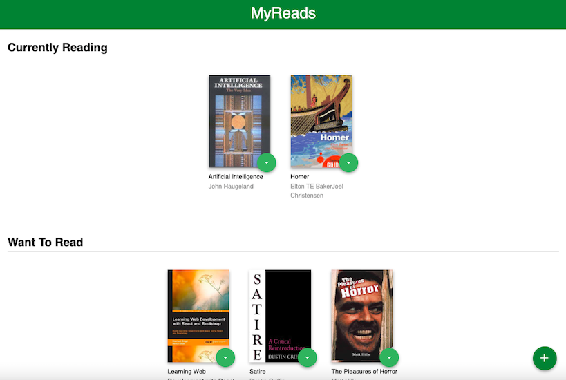

# My Reads

## About

A virtual bookcase that allows users to store books and track what they are reading. Using the provided API, users can search for books and add them to a bookshelf, and also move them from one shelf to another. 



## Motivation

This project is part of [Udacity's React Nanodegree program](https://www.udacity.com/course/react-nanodegree--nd019). Starter files were provided. 

## Technologies

React.

## Installation Instructions

```
$ git clone https://github.com/HannaEb/myreads.git
$ cd myreads
$ npm install
$ npm start
```

Then open [http://localhost:3000](http://localhost:3000) to view the application in the browser.

## Testing

Not yet implemented. 

## Progress

Test suit needs to be added. 

## Author

HannaEb
